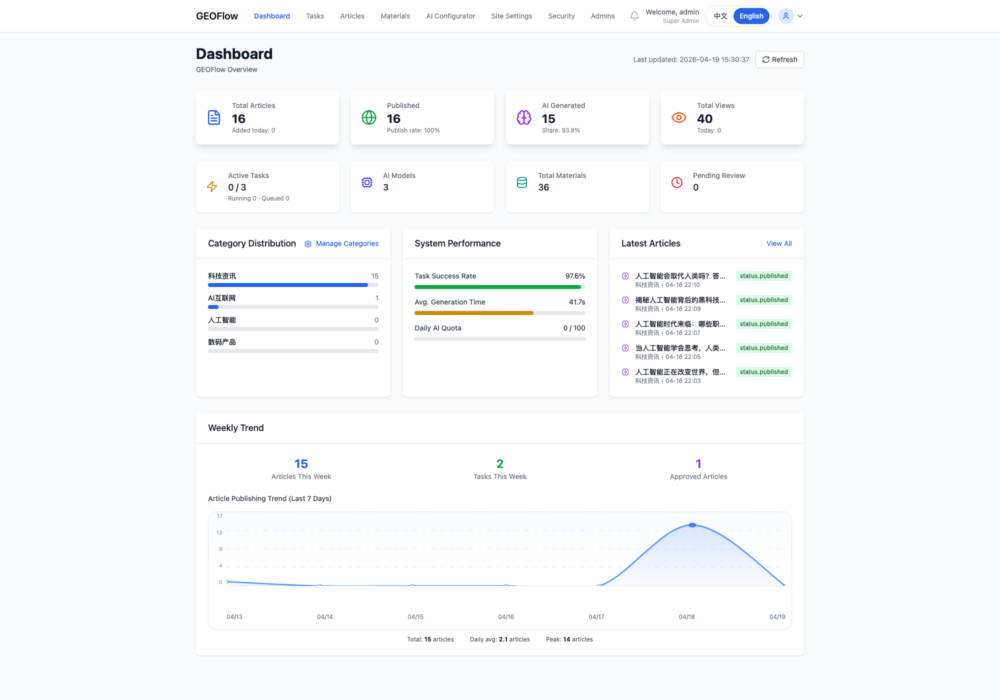
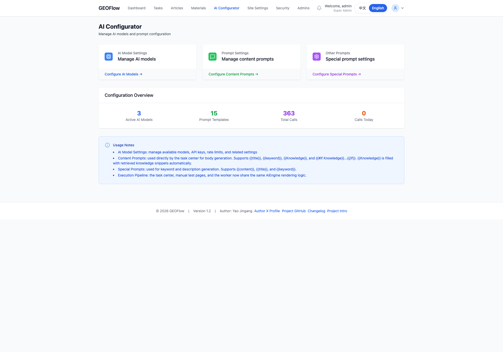

# GEOFlow

> Languages: [简体中文](README.md) | [English](README_en.md) | [日本語](README_ja.md) | [Español](README_es.md) | [Русский](README_ru.md)

> 面向 GEO / SEO 内容运营场景的开源内容生产系统。**本仓库为 Laravel 12 实现**：模型与素材管理、任务调度、队列与监控、草稿审核与前台发布串联为一条链路，适合自动化内容站点或内部运营后台。

[](https://www.php.net/)
[](https://laravel.com/)
[](https://www.postgresql.org/)
[](https://docs.docker.com/compose/)
[](https://opensource.org/licenses/MIT)
[](https://github.com/yaojingang/GEOFlow/stargazers)
[](https://github.com/yaojingang/GEOFlow/network/members)
[](https://github.com/yaojingang/GEOFlow/issues)

框架与骨架代码以 [MIT License](https://opensource.org/licenses/MIT) 发布（见 `composer.json`）；业务代码以仓库根目录约定为准。

---

## ✨ 你可以用它做什么

| 特性 | 说明 |
|------|------|
| 🤖 多模型内容生成 | 兼容 OpenAI 风格接口，可接入不同 AI 服务商 |
| 📦 批量任务运行 | 任务创建、定时调度、队列执行、失败重试；可选 **Laravel Horizon** 监控 |
| 🗂 素材统一管理 | 标题库、关键词库、图片库、知识库、提示词集中管理 |
| 📋 审核与发布工作流 | 草稿、审核、发布流程，可配置自动发布 |
| 🔍 面向搜索展示优化 | 文章 SEO 元信息、Open Graph、结构化数据 |
| 🎨 前台与主题 | 前台文章展示与后台站点/模板配置 |
| ⚡ 实时与广播 | **Laravel Reverb** 等组件支持（按 `.env` 启用） |
| 🐳 可直接部署 | **Docker Compose** 一键拉起 PostgreSQL（pgvector）、Redis、应用、队列、调度与 Reverb |
| 🗄 PostgreSQL 运行时 | 默认基于 PostgreSQL，适合稳定运行与并发写入 |

---

## 🖼 界面预览

<p>
  
  
</p>
<p>
  
  
</p>

上述页面覆盖站点首页、任务调度、文章流程与模型配置等主链路；更多后台说明见 `docs/`（若目录中暂无截图资源，请本地补全或替换为你的截图路径）。

---

## 🏗 运行结构

```
后台管理页面
    ↓
任务调度器 / 队列（Horizon 可选）
    ↓
Worker 执行 AI 生成
    ↓
草稿 / 审核 / 发布
    ↓
前台文章与 SEO 页面输出
```

---

## 🧱 系统架构

| 层级 | 说明 |
|------|------|
| Web / Admin | **Laravel** 路由与控制器；前台文章站点与 **Blade** 后台；内容浏览、素材、任务与配置入口 |
| API | `routes/api.php` 等提供机器可调用的 HTTP 接口（鉴权以项目配置为准） |
| Scheduler / Queue / Reverb | **Laravel Scheduler** 扫描与入队；**`queue:work` / Horizon** 消费任务；**Reverb** 提供 WebSocket（按需启用） |
| Domain & Jobs | `app/Services`、`app/Jobs`、`app/Http/Controllers` 等承载业务规则与 GEO 任务流水线 |
| Persistence | **PostgreSQL**（推荐 **pgvector** 镜像与线上实例一致）+ **Redis**（队列/缓存等） |

核心链路：

1. 在后台配置模型、提示词与素材库  
2. 创建任务并进入调度与队列  
3. Worker（队列进程）调用模型生成正文与元数据  
4. 文章进入草稿、审核、发布链路  
5. 前台输出文章与 SEO 页面  

---

## 🎯 适用场景与目标收益

GEOFlow 适合这些真实且可落地的场景：

- **独立 GEO 官网**  
  把官网内容、产品资料、FAQ、案例和品牌知识组织成一个可持续更新的内容系统。目标是提升 AI 搜索可见度、品牌信源覆盖和内容运营效率，而不是堆砌低质量页面。
- **官网中的 GEO 子频道**  
  在现有官网下搭建一个独立的资讯、知识或解决方案频道。目标是让品牌内容更结构化、更适合搜索引用，也方便不同团队协同更新。
- **独立 GEO 信源站点**  
  面向某个行业、主题或问题域，持续沉淀高质量文章、榜单、解读、指南和资料。目标是构建稳定可信的外部内容资产，而不是做信息污染。
- **GEO 内容管理系统**  
  作为内部内容生产后台，统一管理模型、素材、标题、图片、知识库、审核和发布。目标是提升团队提效、降低重复劳动、减少分散工具切换。
- **GEO 多站点 / 多栏目部署**  
  用同一套系统管理多个站点、多个栏目或多个主题模板。目标是让内容生产、模板切换、分发和维护更标准化。
- **自动化信源管理与内容分发**  
  对知识库、专题内容、资讯更新和内容分发流程进行工程化管理。目标是让真正有价值的信息更稳定地被用户和 AI 理解、引用和检索。

这套系统的收益，应该建立在**真实、优质、持续维护的知识库**之上。  
我们不鼓励利用系统制造信息噪音、批量污染互联网或堆积虚假内容。GEOFlow 的本质是帮助团队更高效地管理、生产和分发可信内容，提升 AI 营销效率和 GEO 运营效率，而不是替代事实、替代判断或替代内容质量本身。

---

## 🧭 场景对应的部署与使用方式

不同场景下，建议这样使用 GEOFlow：

- **作为独立 GEO 官网运行**  
  直接部署完整前台与后台，围绕官网栏目、产品页延展内容、FAQ、案例和专题进行运营。适合希望把官网做成 AI 搜索友好型内容资产的团队。
- **作为官网中的 GEO 子频道运行**  
  将 GEOFlow 作为一个相对独立的内容频道部署，再通过导航、子域名或目录与主站打通。适合不想重构主站、但需要快速上线内容频道的团队。
- **作为 GEO 信源站运行**  
  单独维护一个面向特定主题的内容站点，把知识库和资料建设放在首位，再通过任务系统做稳定更新。适合想做行业型、专题型或问题导向型内容资产的团队。
- **作为内部 GEO 内容管理后台运行**  
  把前台弱化，重点使用后台的模型配置、素材库、任务调度、审核发布与 API 能力。适合内容团队、增长团队、品牌团队做内部生产系统。
- **作为多站点 / 多频道系统运行**  
  使用不同模板、栏目、域名或部署实例，管理多个内容出口。适合需要同时维护多个品牌频道、多个主题站或多个实验站点的团队。
- **作为自动化信源管理系统运行**  
  重点建设知识库、标题库、图片库和提示词体系，把系统当作一个内容工程与分发操作台。适合希望长期沉淀可信知识资产、再逐步扩展自动化能力的团队。

建议的使用顺序是：

1. 先确定真实的业务目标和目标读者  
2. 先建设知识库，再建设自动化流程  
3. 先确保内容真实、可核验、可维护  
4. 再用模型、任务和模板能力去提效  

如果知识库本身不真实、不完整、不稳定，再强的自动化也只会放大噪音。  
所以在 GEOFlow 里，**知识库建设应该始终排在最前面**。

---

## 🚀 快速开始

### 方式一：Docker（开发 / 演示）

```bash
# 1. 克隆仓库
git clone https://github.com/yaojingang/GEOFlow.git
cd GEOFlow

# 2. 复制环境变量
cp .env.example .env

# 3. 按需编辑 .env（数据库、Redis、APP_URL、ADMIN_BASE_PATH、REVERB_* 等）
vi .env

# 4. 构建并启动（含 postgres、redis、init、app、queue、scheduler、reverb）
docker compose build
docker compose up -d
```

- 前台默认访问：`http://localhost:18080`（端口由环境变量 **`APP_PORT`** 控制，默认 `18080`）  
- 后台登录：`http://localhost:18080/geo_admin/login`（前缀由 **`ADMIN_BASE_PATH`** 控制，默认 `geo_admin`）  

首次启动会运行 **`init`** 容器：在数据库就绪后执行首次迁移与种子（默认管理员见下文「默认管理员」）。

### 方式一补充：Docker（生产）

生产环境建议使用 **`docker-compose.prod.yml`**，改为 **`Nginx + php-fpm`**，而不是 `php artisan serve`。

```bash
cp .env.prod.example .env.prod
vi .env.prod

docker compose --env-file .env.prod -f docker-compose.prod.yml build
docker compose --env-file .env.prod -f docker-compose.prod.yml up -d postgres redis
docker compose --env-file .env.prod -f docker-compose.prod.yml up -d init
docker compose --env-file .env.prod -f docker-compose.prod.yml up -d app web queue scheduler reverb
```

- 前台 / 后台统一经 `web`（Nginx）访问  
- PHP 由 `app`（php-fpm）解析  
- **默认管理员**：生产不会自动 `db:seed`，迁移成功后需手动执行一次（命令与账号见 `docs/deployment/DEPLOYMENT.md`「默认管理员（首次种子）」）  
- 详细说明见 `docs/deployment/DEPLOYMENT.md`  

### 方式二：本地 PHP 服务器

**前置要求：** PHP **8.2+**，启用 `pdo_pgsql`、`redis` 等 Laravel 常用扩展；本机已安装 **PostgreSQL** 与 **Redis**；已安装 **Composer 2.x**。

```bash
# 1. 克隆仓库
git clone https://github.com/yaojingang/GEOFlow.git
cd GEOFlow

# 2. 环境与依赖
cp .env.example .env
# 编辑 .env：将 DB_HOST/DB_* 指向本机 Postgres，REDIS_* 指向本机 Redis，QUEUE_CONNECTION=redis 等

composer install --no-interaction --prefer-dist
php artisan key:generate

# 3. 数据库与存储
php artisan migrate --force
php artisan db:seed --force    # 可选：写入默认管理员等
php artisan storage:link

# 4. 开发用 HTTP（仅本地调试；生产请用 Nginx + PHP-FPM，站点根目录 public/）
php artisan serve --host=127.0.0.1 --port=8080
```

另开终端启动常驻进程（与 Docker 中 `queue` / `scheduler` / `reverb` 对应）：

```bash
php artisan queue:work redis --queue=geoflow,default --sleep=1 --tries=1 --timeout=300
php artisan schedule:work
php artisan reverb:start
```

- 后台：`http://127.0.0.1:8080/geo_admin/login`（若修改了 `ADMIN_BASE_PATH` 请替换路径）  
- 生产可用 `php artisan horizon` 替代 `queue:work`（需按项目配置托管进程）  

---

## 环境要求（部署检查清单）

| 组件 | 说明 |
|------|------|
| PHP | **8.2+**（Docker 镜像可为 8.4） |
| 扩展 | Laravel 常规扩展；PostgreSQL 需 `pdo_pgsql`；Redis 队列需 `redis` |
| Composer | 2.x |
| 数据库 | **PostgreSQL**（推荐 **pgvector**，与 `docker-compose.yml` 中镜像一致） |
| Redis | 队列、缓存等（本地极简调试可将 `QUEUE_CONNECTION` 改为 `sync`，生产不推荐） |

---

## 源码部署补充说明

**目录权限（Linux / macOS 常见）：**

```bash
chmod -R ug+rwx storage bootstrap/cache
```

**默认管理员（执行 `php artisan db:seed` 后，以 `Database\\Seeders\\AdminUserSeeder` 为准）：**

| 字段 | 值 |
|------|-----|
| 用户名 | `admin` |
| 密码 | `password`（**生产环境请立即修改**） |

### 管理员登录失败锁定与手动解锁

- 后台账号连续登录失败 **5 次** 会自动锁定（`status=locked`）。
- 被锁定账号无法继续登录，需管理员手动解锁。
- 解锁命令：

```bash
php artisan geoflow:admin-unlock <username>
```

例如：

```bash
php artisan geoflow:admin-unlock admin
```

**生产环境 Web：** 使用 Nginx / Apache + **PHP-FPM**，网站根目录指向项目 **`public/`**，勿将仓库根目录直接暴露为文档根。

---

## Docker 部署补充说明

### 开发 Compose 服务一览

| 服务 | 作用 |
|------|------|
| `postgres` | PostgreSQL 16 + pgvector |
| `redis` | Redis 7 |
| `init` | 一次性初始化（`restart: "no"`） |
| `app` | `php artisan serve`，映射 **`${APP_PORT:-18080}:8080`** |
| `queue` | `queue:work redis` |
| `scheduler` | `schedule:work` |
| `reverb` | WebSocket，映射 **`${REVERB_EXPOSE_PORT:-18081}:8080`** |

宿主机仅绑定 **127.0.0.1** 暴露数据库 / Redis 端口时，见 `docker-compose.yml` 中的 `DB_EXPOSE_PORT`、`REDIS_EXPOSE_PORT`。

### 入口脚本（`docker/entrypoint.sh`）常用变量

| 变量 | 默认 | 含义 |
|------|------|------|
| `COMPOSER_ON_START` | `true` | 容器启动时执行 `composer install` |
| `AUTO_MIGRATE` | `true` | 每次启动执行 `php artisan migrate --force` |
| `AUTO_INIT_ONCE` | 仅 `init` 为 `true` | 新库时执行一次 `migrate` + `db:seed` |
| `AUTO_GENERATE_APP_KEY` | `init` 内为 `true` | 无有效 `APP_KEY` 时自动生成 |
| `AUTO_SEED` | `false` | 为 `true` 时**每次**启动都 `db:seed`（慎用） |

Compose 将 **`./storage`** 与 **`./.env`** 挂载进容器；应用代码在镜像内。若要用于正式生产，请改用仓库新增的 **`docker-compose.prod.yml`**（`Nginx + php-fpm`），并参见 `docs/deployment/DEPLOYMENT.md`。

**升级建议：** `git pull` → `docker compose build` → `docker compose up -d`。

---

## 开发与测试

```bash
composer test
./vendor/bin/pint
```

---

## 🌍 多语言文档

- [English README](README_en.md)
- [日本語 README](README_ja.md)
- [Español README](README_es.md)
- [Русский README](README_ru.md)

---

## ⭐ Star 趋势

[](https://star-history.com/#yaojingang/GEOFlow&Date)
