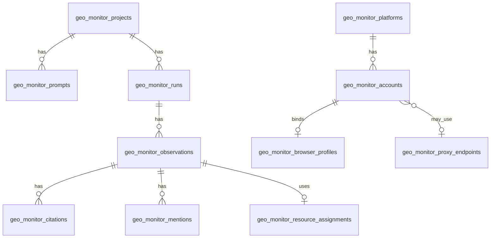

# GEO 监测数据模型（Laravel）

迁移：`database/migrations/2026_06_04_100000_create_geo_monitor_tables.php`

## 表关系概览



## 模型类

| 表 | 模型 |
| --- | --- |
| `geo_monitor_projects` | `App\Models\GeoMonitorProject` |
| `geo_monitor_platforms` | `App\Models\GeoMonitorPlatform` |
| `geo_monitor_prompts` | `App\Models\GeoMonitorPrompt` |
| `geo_monitor_runs` | `App\Models\GeoMonitorRun` |
| `geo_monitor_observations` | `App\Models\GeoMonitorObservation` |
| `geo_monitor_citations` | `App\Models\GeoMonitorCitation` |
| `geo_monitor_mentions` | `App\Models\GeoMonitorMention` |
| `geo_monitor_scores` | `App\Models\GeoMonitorScore` |
| `geo_monitor_accounts` | `App\Models\GeoMonitorAccount` |
| `geo_monitor_browser_profiles` | `App\Models\GeoMonitorBrowserProfile` |
| `geo_monitor_proxy_endpoints` | `App\Models\GeoMonitorProxyEndpoint` |
| `geo_monitor_resource_assignments` | `App\Models\GeoMonitorResourceAssignment` |
| `geo_monitor_profile_maintenance_events` | `App\Models\GeoMonitorProfileMaintenanceEvent` |

## 与 POC sidecar 的映射

| Sidecar `ProbeResult` | 持久化目标 |
| --- | --- |
| `status` / `login_status` | `geo_monitor_observations` |
| `answer_text` | `answer_text` + `answer_hash` |
| `citations[]` | `geo_monitor_citations` |
| `evidence.*_path` | 观测表路径字段 |
| `meta.resource` | `geo_monitor_resource_assignments.meta` |
| `account_id` | `geo_monitor_accounts.external_id` 查找 |

敏感 Cookie **不**写入 `geo_monitor_accounts`；仅 `profile_storage_path` 指向 sidecar 卷。

## 评分与报表

- `GeoMonitorCitationNormalizer`：引用 URL 去追踪参数、域名归属判定
- `GeoMonitorAttributionScorer`：观测级 / 批次级 GEO 综合分（`geo_monitor_scores`，版本 `v1`）
- `GeoMonitorAttributionReportService`：后台报表（平台拆解、问题拆解、竞品对比、TOP 来源、失败分布）

综合分权重见 `config/geoflow.php` → `geo_monitor.scoring_weights`。

## 配置

`config/geoflow.php` → `geo_monitor`：

- `GEOFLOW_GEO_MONITOR_ENABLED`
- `GEOFLOW_GEO_MONITOR_SIDECAR_URL`
- `GEOFLOW_GEO_MONITOR_SIDECAR_TOKEN`

## 迁移

```bash
php artisan migrate
php artisan test --filter=GeoMonitorSchemaMigrationTest
```
