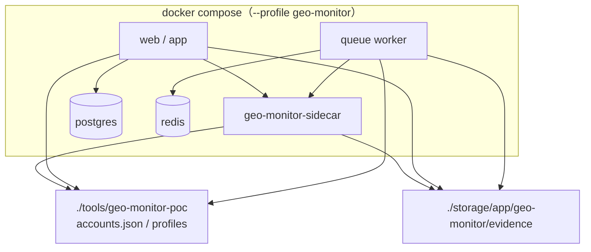

# GEO 监测 Docker 部署

GEO 监测 sidecar（Chromium + noVNC + HTTP API）已并入主 Compose 栈，通过 **`geo-monitor` profile** 按需启用。未带该 profile 时，不会构建或启动 sidecar 容器。

## 架构



Laravel 与 sidecar 通过 Compose 内网 DNS 通信：`http://geo-monitor-sidecar:8765`。

## 首次准备

```bash
# 若尚无 accounts.json，从样例复制（Laravel 导出也会覆盖写入）
cp tools/geo-monitor-poc/accounts.sample.json tools/geo-monitor-poc/accounts.json

mkdir -p tools/geo-monitor-poc/profiles
# storage/app/geo-monitor/evidence 由 Docker entrypoint 自动创建，无需手动 mkdir
```

## 开发环境

`.env` 中启用 GEO 监测并指向 Compose 服务名：

```env
GEOFLOW_GEO_MONITOR_ENABLED=true
GEOFLOW_GEO_MONITOR_RUNTIME=headless_linux
GEOFLOW_GEO_MONITOR_SIDECAR_URL=http://geo-monitor-sidecar:8765
GEOFLOW_GEO_MONITOR_SIDECAR_TOKEN=your-random-token
GEOFLOW_GEO_MONITOR_POC_ROOT=tools/geo-monitor-poc
# 证据目录（默认 storage/app/geo-monitor/evidence，与 ./storage 挂载共用）
GEOFLOW_GEO_MONITOR_EVIDENCE_ROOT=storage/app/geo-monitor/evidence
```

启动（带 `geo-monitor` profile）：

```bash
docker compose --profile geo-monitor up -d --build
```

仅重启 sidecar：

```bash
docker compose --profile geo-monitor up -d geo-monitor-sidecar
```

不带 profile 时 sidecar **不会**出现在 `docker compose ps` 中，其余服务照常运行。

## 生产环境

`.env.prod` 示例：

```env
GEOFLOW_GEO_MONITOR_ENABLED=true
GEOFLOW_GEO_MONITOR_RUNTIME=headless_linux
GEOFLOW_GEO_MONITOR_SIDECAR_URL=http://geo-monitor-sidecar:8765
GEOFLOW_GEO_MONITOR_SIDECAR_TOKEN=your-random-token
GEOFLOW_GEO_MONITOR_POC_ROOT=tools/geo-monitor-poc
# 证据目录（默认 storage/app/geo-monitor/evidence，与 ./storage 挂载共用）
GEOFLOW_GEO_MONITOR_EVIDENCE_ROOT=storage/app/geo-monitor/evidence
```

```bash
docker compose --env-file .env.prod -f docker-compose.prod.yml up -d --build
docker compose --env-file .env.prod -f docker-compose.prod.yml --profile geo-monitor up -d geo-monitor-sidecar
```

或一条命令启动全部（含 sidecar）：

```bash
docker compose --env-file .env.prod -f docker-compose.prod.yml --profile geo-monitor up -d --build
```

生产 `app` / `queue` / `sidecar` 共享：
- `./tools/geo-monitor-poc` → 账号配置、浏览器 Profile
- `./storage` → 探测证据 `storage/app/geo-monitor/evidence/`（宿主机可直接备份）

## noVNC 远程维护

sidecar 容器内 websockify 监听 **0.0.0.0:6080**（Docker 端口映射要求）；宿主机映射仍为 **127.0.0.1:6080**，不暴露公网：

| 端口 | 用途 |
|------|------|
| 6080 | noVNC 网页 |
| 8765 | sidecar HTTP API（调试时可本地转发） |

SSH 隧道：

```bash
ssh -L 6080:127.0.0.1:6080 -L 8765:127.0.0.1:8765 deploy@your-server
```

浏览器打开 `http://127.0.0.1:6080/vnc.html`。详细运维流程见 [geo-monitoring-novnc.md](./geo-monitoring-novnc.md)。

## 环境变量（Compose 层）

| 变量 | 默认 | 说明 |
|------|------|------|
| `GEOFLOW_GEO_MONITOR_NOVNC_PORT` | `6080` | 宿主机 noVNC 映射端口 |
| `GEOFLOW_GEO_MONITOR_SIDECAR_PORT` | `8765` | 宿主机 sidecar API 映射端口（可选，便于本机调试） |
| `GEOFLOW_GEO_MONITOR_SIDECAR_TOKEN` | 空 | sidecar Bearer Token，生产务必设置 |

## 不使用 Docker sidecar 时

若 sidecar 跑在宿主机或其它机器，**不要**加 `--profile geo-monitor`，并在 `.env` / `.env.prod` 中自行设置 `GEOFLOW_GEO_MONITOR_SIDECAR_URL`（例如 `http://host.docker.internal:8765` 或实际 IP）。

## 资源建议

sidecar 含 Chromium，建议：

- `shm_size: 1gb`（已在 compose 中配置）
- 单机 4 GB+ 内存，维护时预留可见浏览器资源
- 6080 / 8765 **勿暴露公网**

## 镜像构建加速

旧版 Dockerfile 会执行 `scrapling install --force`，重复下载 Playwright 浏览器（常需 30–90 分钟）。当前优化：

| 优化项 | 效果 |
|--------|------|
| 跳过 `scrapling install`，使用 apt `chromium` | 省去最大头 |
| `requirements-docker.txt`（`scrapling[fetchers]`，不含 `[all]`） | 含 curl_cffi/playwright，避免 patchright/mcp 等大包 |
| `.dockerignore` 排除 `.venv` / `profiles` / `evidence` | 避免 build context 上传 GB 级文件 |
| apt / pip 默认阿里云镜像 | 与主项目 Docker 策略一致 |
| 兼容经典 `docker build`（无 BuildKit 必需项） | ECS 默认 Docker 可直接构建 |
| `python:3.12-slim-bookworm` 基础镜像 | 更小、拉取更快 |

**推荐构建命令**（先单独构建 sidecar，不要和 PHP 镜像一起 `--build`）：

```bash
# 仅构建 sidecar（首次约 5–15 分钟，视网络而定）
docker compose --env-file .env.prod -f docker-compose.prod.yml \
  --profile geo-monitor build geo-monitor-sidecar

# 再启动全栈（已构建的可跳过 --build）
docker compose --env-file .env.prod -f docker-compose.prod.yml \
  --profile geo-monitor up -d
```

若报错 `the --mount option requires BuildKit`，说明使用了旧版 Dockerfile；`git pull` 后重新 build 即可。可选启用 BuildKit 加速二次构建：

```bash
export DOCKER_BUILDKIT=1 COMPOSE_DOCKER_CLI_BUILD=1
```

国内服务器默认已使用阿里云 apt + pip，一般无需再改。海外构建若需官方源，在 `.env.prod` 中覆盖：

```env
GEO_MONITOR_PIP_INDEX_URL=https://pypi.org/simple
GEO_MONITOR_PIP_TRUSTED_HOST=
```

若旧镜像构建已卡住，先 `Ctrl+C` 终止，再：

```bash
docker compose --profile geo-monitor build --no-cache geo-monitor-sidecar
```

## 相关文档

- [geo-monitoring-novnc.md](./geo-monitoring-novnc.md) — noVNC 维护流程
- [geo-monitoring-dual-runtime.md](./geo-monitoring-dual-runtime.md) — headed_desktop vs headless_linux
- [deployment/DEPLOYMENT.md](./deployment/DEPLOYMENT.md) — 生产 Docker 总览
