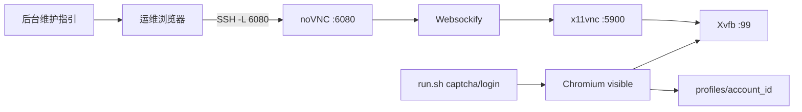

# GEO 监测 noVNC 远程维护通道

## 用途

在生产 Linux 服务器上，当探测返回 `captcha_required` 或 `needs_login` 时，运维人员通过 **noVNC 网页远程桌面** 进入与 sidecar **同一台机器、同一 profile、同一代理** 的 Chromium 环境，人工完成验证码或登录后保存 profile，再无头恢复采集。

noVNC **不参与自动绕过验证码**，仅作为人工维护入口。

## 架构



## 脚本（`tools/geo-monitor-poc/scripts/novnc/`）

| 脚本 | 说明 |
|------|------|
| `start-novnc.sh` | 启动 Xvfb、fluxbox、x11vnc、websockify |
| `stop-novnc.sh` | 停止上述进程 |
| `status-novnc.sh` | 查看运行状态 |
| `maintain-profile.sh` | 启动 noVNC 并执行 `captcha` 或 `login` |
| `health-check.sh` | 维护后无头 ask 健康检查 |

## 标准运维流程

1. 后台 **平台账号** → 点击 **同步 sidecar 账号**（导出 `accounts.json`，含代理绑定）
2. 异常账号点击 **维护指引** → **开始维护**（写入 `geo_monitor_profile_maintenance_events`，锁定调度）
3. 服务器 SSH：

```bash
cd /opt/geoflow/tools/geo-monitor-poc
./scripts/novnc/start-novnc.sh
./scripts/novnc/maintain-profile.sh --platform doubao --account-id doubao_account_01
```

4. 本机 SSH 隧道：

```bash
ssh -L 6080:127.0.0.1:6080 -L 8765:127.0.0.1:8765 deploy@your-server
```

5. 浏览器打开 `http://127.0.0.1:6080/vnc.html`，在远程桌面完成验证码/登录
6. 回到服务器终端按 **Enter** 保存 profile
7. 健康检查：

```bash
./scripts/novnc/health-check.sh --platform doubao --account-id doubao_account_01
```

8. 后台点击 **Sidecar 登录态检查** 或 **完成维护**（勾选健康通过）→ 账号恢复 `active`

## 安全基线

- `GEOFLOW_GEO_MONITOR_NOVNC_BIND=127.0.0.1`（默认），**禁止**把 6080/5900 裸露公网
- 通过 SSH 隧道、VPN 或堡垒机访问 noVNC
- 可选 VNC 密码：`x11vnc -storepasswd` 生成后设置 `GEO_MONITOR_VNC_PASSWORD_FILE`
- 维护日志不记录 Cookie、密码、验证码内容

## Docker 部署

sidecar 已并入仓库根目录 `docker-compose.yml` / `docker-compose.prod.yml`，通过 Compose **profile `geo-monitor`** 按需启动：

```bash
# 开发
docker compose --profile geo-monitor up -d --build

# 生产
docker compose --env-file .env.prod -f docker-compose.prod.yml --profile geo-monitor up -d --build
```

`.env` / `.env.prod` 中设置 `GEOFLOW_GEO_MONITOR_SIDECAR_URL=http://geo-monitor-sidecar:8765`。

完整说明见 [geo-monitoring-docker.md](./geo-monitoring-docker.md)。

独立调试（不推荐日常使用）：

```bash
cd tools/geo-monitor-poc/docker
docker compose -f docker-compose.novnc.yml --profile geo-monitor up -d --build
```

## Laravel 配置

| 环境变量 | 默认 | 说明 |
|----------|------|------|
| `GEOFLOW_GEO_MONITOR_NOVNC_ENABLED` | `true` | 功能开关 |
| `GEOFLOW_GEO_MONITOR_POC_ROOT` | `tools/geo-monitor-poc` | POC 根目录（后台生成命令） |
| `GEOFLOW_GEO_MONITOR_NOVNC_BIND` | `127.0.0.1` | noVNC 监听地址 |
| `GEOFLOW_GEO_MONITOR_NOVNC_PORT` | `6080` | noVNC 端口 |
| `GEOFLOW_GEO_MONITOR_DISPLAY` | `:99` | Xvfb 显示号 |
| `GEOFLOW_GEO_MONITOR_SSH_HOST` | 空 | 后台隧道示例，如 `deploy@1.2.3.4` |

## 服务器最低配置（单机 POC / 小规模生产）

适用于 **1 台服务器** 同时跑 GEOFlow Laravel + Redis + sidecar + noVNC，**每平台 1–3 个账号**、手动/低频批次采集。

| 项目 | 最低建议 | 说明 |
|------|----------|------|
| **CPU** | 2 vCPU | 无头 probe 时 CPU 占用低；**维护时**可见 Chromium 需要额外算力 |
| **内存** | **4 GB** | Laravel ~512MB + Redis ~256MB + Chromium 无头 ~300MB；**维护时建议预留 1.5GB+ 给可见浏览器** |
| **磁盘** | **40 GB SSD** | 系统 + Docker/venv；`profiles/` 每账号约 100–500MB；`evidence/` 按保留策略增长 |
| **系统** | Ubuntu 22.04/24.04 或 Debian 12 | 需 apt 安装 `xvfb fluxbox x11vnc novnc websockify chromium` |
| **网络** | 稳定出口 + 可选 HTTP 代理 | 平台访问走绑定代理；noVNC **仅本机/隧道**，不需公网带宽 |
| **swap** | 2 GB（可选） | 内存紧张时防止 OOM 杀 Chromium |

### 推荐配置（更舒适）

| 项目 | 推荐 |
|------|------|
| CPU | 4 vCPU |
| 内存 | **8 GB** |
| 磁盘 | 80 GB SSD |
| 并发 | 每平台 1 个无头会话 + 维护时不开 probe |

### 软件依赖（Debian/Ubuntu）

```bash
sudo apt update
sudo apt install -y xvfb fluxbox x11vnc novnc websockify \
  chromium chromium-driver fonts-noto-cjk
```

Python 侧在 `tools/geo-monitor-poc` 执行 `./scripts/setup.sh`。

### 不适合最低配的场景

- 多账号 **同时** 可见浏览器维护
- 多平台 **高并发** 无头 probe（需加内存、独立 sidecar 节点）
- 不把 6080 暴露公网却期望多人同时远程维护（应走堡垒机/隧道）

## 与资源池联动

- `needs_maintenance` / `needs_login` 账号 **不可被调度**
- 点击 **开始维护** 写入 `geo_monitor_profile_maintenance_events`，状态 `in_progress`
- 维护完成且健康检查通过后：账号 `active`，Profile `healthy`，事件 `succeeded`

详见 [geo-monitoring-resource-pool.md](./geo-monitoring-resource-pool.md)。
