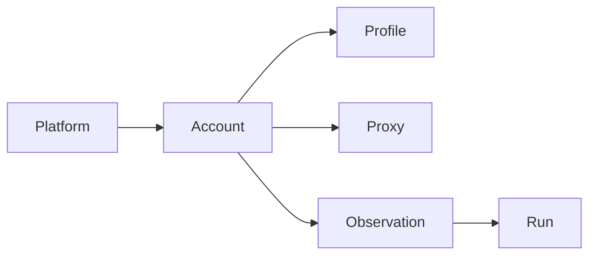

# GEO 监测资源池与风控调度

## 目标

在豆包 / DeepSeek / 腾讯元宝等多平台采集时，统一管理：

- **平台账号**（`geo_monitor_accounts`）
- **指纹浏览器 Profile**（`geo_monitor_browser_profiles`）
- **代理出口**（`geo_monitor_proxy_endpoints`）

并通过队列 Job 按健康、冷却、额度与串行锁自动选取资源，探测结束后回写风控状态。

## 数据模型关系

- 每个账号绑定一个 Profile 目录（与 sidecar `accounts.json` 的 `profile_path` 一致）。
- 代理可选；绑定后探测 payload 会带上 `resource.proxy`。
- 观测记录保存 `account_id` 与 `scheduler_strategy`（`pool_least_busy` / `pinned_account`）。

## 调度策略

### 可调度条件（全部满足）

| 维度 | 条件 |
|------|------|
| 账号 | `status = active`，无 `cooldown_until` |
| Profile | `health_status ∈ {unknown, healthy}` |
| 代理 | 未绑定，或 `status = active` 且无冷却 |
| 额度 | 近 1h / 24h 成功+运行中观测数未超 `hourly_quota` / `daily_quota` |

### 选取算法

1. **批次创建**（`GeoMonitorRunService::startRun`）：按平台调用 `selectForPlatform`，为该平台所有观测预分配同一账号（`pool_least_busy`）。
2. **Job 执行**（`ProcessGeoMonitorProbeJob`）：
   - 若观测已有 `account_id` 且仍满足条件 → `pinned_account`
   - 否则重新从池选取 → `pool_least_busy`
   - 无可用账号 → 观测标记 `failed`，错误信息说明检查项
3. **并发控制**：同账号 Redis 锁 `geo-monitor:account-lock:{id}`，默认 TTL 300s；锁占用时 Job `release(30)` 延迟重试。

### 环境变量

| 变量 | 默认 | 说明 |
|------|------|------|
| `GEOFLOW_GEO_MONITOR_LOCK_CACHE_STORE` | `redis` | 锁使用的缓存驱动 |
| `GEOFLOW_GEO_MONITOR_ACCOUNT_LOCK_SECONDS` | `300` | 账号串行锁 TTL |
| `GEOFLOW_GEO_MONITOR_CAPTCHA_COOLDOWN_MINUTES` | `120` | 验证码后冷却 |
| `GEOFLOW_GEO_MONITOR_FAILURE_COOLDOWN_MINUTES` | `30` | 连续失败后冷却 |
| `GEOFLOW_GEO_MONITOR_FAILURES_BEFORE_COOLDOWN` | `3` | 触发冷却的失败次数 |

## 风控回写（探测终态）

由 `GeoMonitorResourceHealthService::handleProbeOutcome` 在 Job `finally` 中执行：

| 观测状态 | 账号 | Profile | 代理 |
|----------|------|---------|------|
| `success` / `partial` | 清零连续失败 | — | — |
| `captcha_required` | `needs_maintenance` + 冷却 | `degraded` | `failure_count++` |
| `needs_login` | `needs_login` | `maintenance` | — |
| `failed` / `selector_miss` | 累计失败，达阈值 → `cooldown` | — | 可能递增失败 |

人工处理验证码或重新登录后，在后台将账号状态改回 `active`，并视情况修复 Profile 健康。

## 后台运维

- **平台账号**列表：展示 Profile/代理健康、小时/日额度用量、是否可调度、串行锁与运行中观测数。
- **代理出口**列表：展示最近健康状态、冷却截止、失败计数。
- 账号状态支持：`active`、`disabled`、`needs_login`、`needs_maintenance`、`cooldown`。

## Sidecar 对接

`GeoMonitorResourceBundle::toSidecarResource()` 生成 probe payload 的 `resource` 字段，包含：

- `account_id`（external_id）
- `profile_path`
- `proxy`（scheme/host/port/认证，如有）

与 `tools/geo-monitor-poc/docs/SIDECAR_API.md` 中的资源段保持一致。

## 运维建议

1. 一账号一 Profile，避免 sidecar `SingletonLock` 冲突。
2. 验证码账号用 `./run.sh captcha` 人工处理后，后台改回 `active`。
3. 生产环境锁驱动使用 `redis`，与队列 worker 同实例。
4. 按平台设置合理 `hourly_quota` / `daily_quota`，防止触发平台风控。
